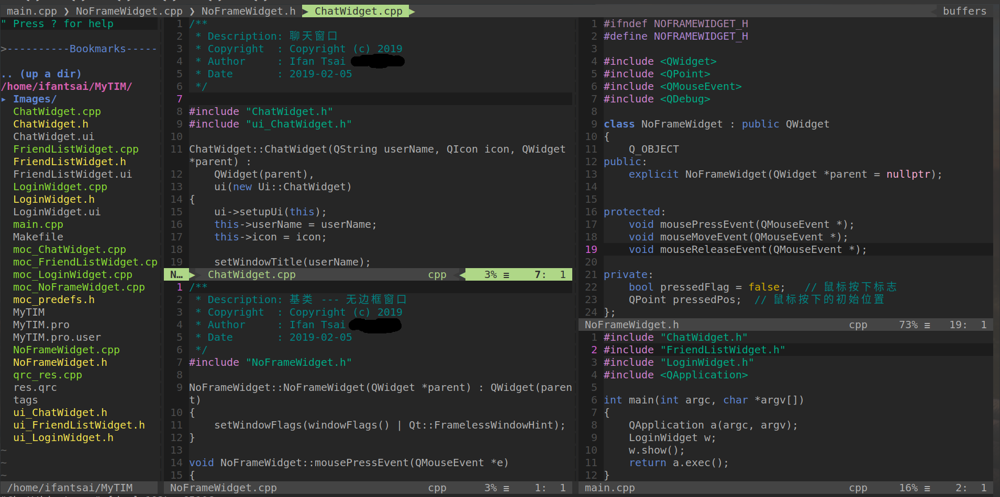

# vim-config
**A lightweight vim configuration.**

## Screenshot

## Key-map 
- ,w: save
- ctrl + h/j/k/l: switch window
- ,t: create tag file
- ,c: clean up all the space at the end of the line

## Plugins
- VundleVim/Vundle.vim
- jiangmiao/auto-pairs
- ntpeters/vim-better-whitespace
- vim-airline/vim-airline
- vim-airline/vim-airline-themes
- Valloric/YouCompleteMe
- scrooloose/nerdtree